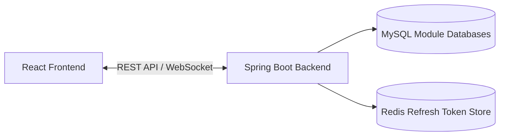
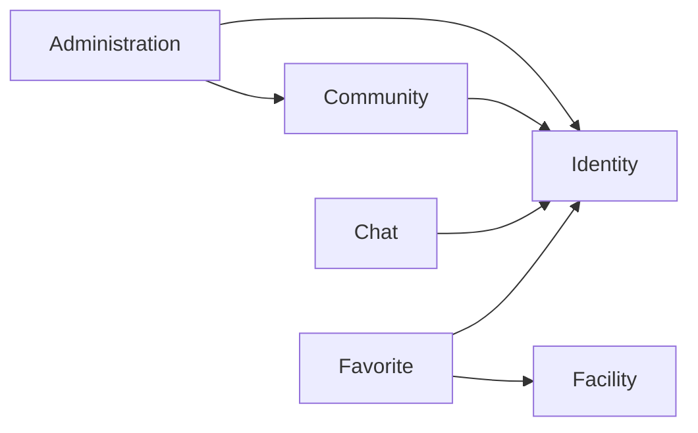
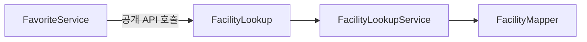

# 봄길요양 프로젝트 소개

> 요양시설 탐색과 정보 공유를 지원하는 웹 서비스  
> Spring Modulith 기반으로 모듈 경계와 데이터 소유권을 명확하게 개선했습니다.

## 서비스 소개

봄길요양은 사용자가 지도에서 요양시설을 검색하고 시설의 상세 정보를 확인할 수 있도록 지원하는 웹 서비스입니다.

시설 즐겨찾기, 커뮤니티, 관리자와의 실시간 채팅 등 요양시설 선택에 필요한 기능을 한곳에서 제공합니다.

## 주요 기능

- 회원가입, 로그인 및 회원 정보 관리
- 지도 기반 요양시설 검색
- 시설 상세 정보 및 주변 공원 조회
- 관심 시설 즐겨찾기
- 게시글, 댓글, 좋아요 및 파일 첨부
- 관리자와의 1:1 실시간 채팅
- 사용자 및 커뮤니티 관리자 기능
- 장기요양등급 테스트

## 아키텍처 개선 배경

기존 백엔드에는 다음과 같은 문제가 있었습니다.

- 도메인 사이의 직접 참조
- 다른 도메인의 Entity와 Repository 노출
- 인증 모듈과 채팅 모듈의 양방향 의존
- 여러 도메인이 하나의 데이터베이스 공유
- 모듈 간 의존 규칙을 수동으로 관리

기존 기능은 유지하면서 변경 영향 범위를 줄이기 위해 다음과 같이 개선했습니다.

| 기존 구조 | 개선 구조 |
|---|---|
| 도메인 내부 객체 직접 참조 | 공개 API를 통한 단방향 참조 |
| Entity와 Repository 외부 노출 | 공개 인터페이스와 Summary 객체 제공 |
| 불분명한 모듈 경계 | Spring Modulith로 모듈 경계 정의 |
| 여러 모듈이 하나의 DB 공유 | 모듈별 논리 데이터베이스 분리 |
| JPA 및 QueryDSL 중심 데이터 접근 | MyBatis 기반의 명시적인 SQL |
| Refresh Token을 MySQL에 저장 | Redis와 TTL을 이용한 저장 |
| 구조 위반을 수동으로 확인 | 아키텍처 테스트로 자동 검증 |

## 전체 시스템 구성



- 프론트엔드와 백엔드는 REST API로 통신합니다.
- 실시간 채팅은 WebSocket과 STOMP를 사용합니다.
- 업무 데이터는 MySQL의 모듈별 데이터베이스에 저장합니다.
- Refresh Token은 Redis에서 만료 시간과 함께 관리합니다.

## 모듈 구성

| 모듈 | 책임 | 참조 모듈 |
|---|---|---|
| `identity` | 인증, 사용자 정보, JWT 및 Refresh Token 관리 | 없음 |
| `facility` | 요양시설 검색, 상세 정보 및 지도 데이터 관리 | 없음 |
| `favorite` | 사용자별 관심 시설 관리 | `identity`, `facility` |
| `community` | 게시글, 댓글, 좋아요 및 첨부파일 관리 | `identity` |
| `chat` | 사용자와 관리자 사이의 실시간 채팅 | `identity` |
| `administration` | 사용자 및 커뮤니티 관리자 기능 | `identity`, `community` |
| `infrastructure` | 공통 웹 설정과 외부 연동 설정 | 없음 |

## 모듈 의존 관계

화살표는 해당 모듈을 참조한다는 의미입니다.



`identity`와 `facility` 모듈은 다른 업무 모듈을 참조하지 않습니다.

다른 모듈의 기능이 필요한 경우 해당 모듈의 Entity, Mapper 또는 내부 Service를 직접 참조하지 않고 공개 API를 사용합니다.

## 모듈 공개 API

### Identity 모듈

| 공개 API | 종류 | 제공 기능 |
|---|---|---|
| `AuthenticatedUser` | Record | 현재 인증된 사용자의 ID, 이메일, 이름 및 권한 제공 |
| `UserDirectory` | Interface | 사용자 ID 또는 이메일을 이용한 사용자 정보 조회 |
| `UserSummary` | Record | 다른 모듈에 필요한 사용자 정보만 전달 |
| `UserAdministration` | Interface | 일반 사용자와 탈퇴 사용자 조회 및 사용자 상태 변경 |

### Facility 모듈

| 공개 API | 종류 | 제공 기능 |
|---|---|---|
| `FacilityLookup` | Interface | 시설 ID를 이용한 단건 또는 다건 시설 정보 조회 |
| `FacilitySummary` | Record | 시설명, 주소, 위치, 평점 및 정원 정보 제공 |

### Community 모듈

| 공개 API | 종류 | 제공 기능 |
|---|---|---|
| `CommunityStatistics` | Interface | 사용자별 커뮤니티 활동 수 조회 |
| `CommunityActivityCount` | Record | 사용자의 게시글 수와 댓글 수 제공 |

## Summary 객체

`UserSummary`, `FacilitySummary`, `CommunityActivityCount`는 다른 모듈에 Entity 전체를 노출하지 않고 실제로 필요한 정보만 전달하기 위한 모듈 간 계약 객체입니다.

이를 통해 다음과 같은 효과를 얻을 수 있습니다.

- 내부 Entity 구조 은닉
- 불필요한 데이터 노출 방지
- 모듈 간 결합도 감소
- 내부 구현 변경의 영향 범위 축소

### 공개 API 사용 예시

`favorite` 모듈은 시설 정보를 조회할 때 `FacilityMapper`나 Facility Entity를 직접 참조하지 않습니다.



`FavoriteService`는 `FacilityLookup`이라는 계약만 알고 있으며 실제 데이터 조회 방식은 `facility` 모듈 내부에 숨겨집니다.

## 데이터 계층

기존의 JPA와 QueryDSL을 MyBatis로 전환했습니다.

MyBatis를 사용해 각 모듈의 데이터 접근 범위와 실행 SQL을 코드에서 명확하게 확인할 수 있도록 구성했습니다.

### 모듈별 데이터베이스

각 업무 모듈은 자신이 담당하는 논리 데이터베이스를 사용합니다.

| 모듈 | 데이터베이스 |
|---|---|
| Identity | `identity_db` |
| Community | `community_db` |
| Chat | `chat_db` |
| Facility | `facility_db` |
| Favorite | `favorite_db` |

현재 구성은 하나의 MySQL 서버 안에서 데이터베이스를 논리적으로 분리한 형태입니다.

### 데이터베이스 구성 요소

| 구성 요소 | 역할 |
|---|---|
| `DataSource` | 해당 모듈의 데이터베이스 연결 제공 |
| `SqlSessionFactory` | MyBatis 설정과 Mapper를 기반으로 SQL 실행 세션 생성 |
| `SqlSessionTemplate` | Spring 환경에서 MyBatis 세션 관리 |
| `TransactionManager` | 모듈별 트랜잭션 시작, 커밋 및 롤백 관리 |
| `Flyway` | 모듈별 스키마 생성과 변경 이력 관리 |

한 모듈의 스키마 변경이 다른 모듈의 데이터 계층에 직접 영향을 주지 않도록 구성했습니다.

## Redis 기반 Refresh Token 관리

기존에는 Refresh Token을 MySQL에 저장했지만 현재는 Redis에 저장합니다.

### 저장 구조

```text
Key   : auth:refresh:{userId}
Value : Refresh Token
TTL   : 7일
```

Refresh Token은 7일의 TTL과 함께 저장되며 만료되면 Redis에서 자동으로 삭제됩니다.

Access Token은 JWT 자체 검증을 사용하고, 서버 측 검증과 폐기가 필요한 Refresh Token만 Redis에서 관리합니다.

로그아웃하거나 회원이 탈퇴하면 Redis에 저장된 Refresh Token을 즉시 삭제합니다.

## 기술 스택

### Frontend

| 기술 | 용도 |
|---|---|
| React 19 | 사용자 인터페이스 |
| Vite 8 | 개발 서버 및 빌드 |
| React Router | 페이지 라우팅 |
| Axios | REST API 통신 |
| Tailwind CSS | UI 스타일링 |
| Kakao Maps SDK | 지도와 시설 위치 표시 |
| SockJS / STOMP | 실시간 채팅 |

### Backend

| 기술 | 용도 |
|---|---|
| Java 21 | 백엔드 개발 언어 |
| Spring Boot 4 | 애플리케이션 프레임워크 |
| Spring Modulith | 모듈 경계와 의존 관계 관리 |
| Spring Security | 인증 및 인가 |
| JWT | Access Token 및 Refresh Token |
| MyBatis | SQL 기반 데이터 접근 |
| WebSocket / STOMP | 실시간 채팅 |
| Flyway | 데이터베이스 마이그레이션 |
| Springdoc OpenAPI | API 문서화 |

### Data & Infrastructure

| 기술 | 용도 |
|---|---|
| MySQL 8.4 | 업무 데이터 저장 |
| Redis 7 | Refresh Token 저장 및 TTL 관리 |
| Docker Compose | 로컬 MySQL 및 Redis 실행 |
| H2 | Mapper 통합 테스트 |

## 프로젝트 구조

```text
Bomgilyoyang-Cloud
├─ backend
│  ├─ src/main/java/com/gooroomees/neulbomgil_backend
│  │  ├─ administration
│  │  ├─ chat
│  │  ├─ community
│  │  ├─ facility
│  │  ├─ favorite
│  │  ├─ identity
│  │  └─ infrastructure
│  ├─ src/main/resources
│  │  ├─ db/migration
│  │  └─ application.properties
│  ├─ src/test
│  ├─ docker/mysql/init
│  ├─ compose.yaml
│  └─ build.gradle
│
└─ frontend
   ├─ src
   │  ├─ api
   │  ├─ components
   │  ├─ context
   │  ├─ hooks
   │  ├─ pages
   │  └─ services
   ├─ package.json
   └─ vite.config.js
```

## 개선 결과

### 모듈 경계

모듈의 역할과 허용되는 의존 관계를 코드로 명확하게 정의했습니다.

### 데이터 소유권

각 모듈이 자신의 데이터베이스와 Mapper를 관리하도록 구성했습니다.

### 인증 상태 관리

Refresh Token의 저장과 만료를 Redis와 TTL로 관리하도록 개선했습니다.

### 자동 검증

테스트 단계에서 모듈 경계 위반과 주요 기능의 회귀를 확인할 수 있도록 구성했습니다.
